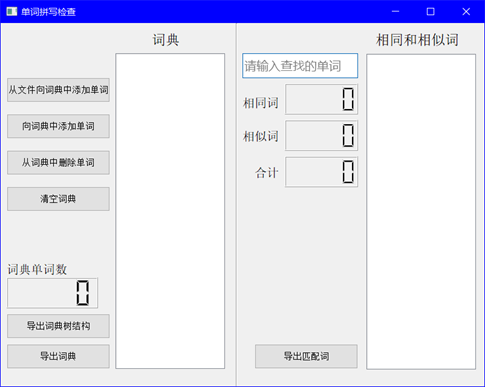
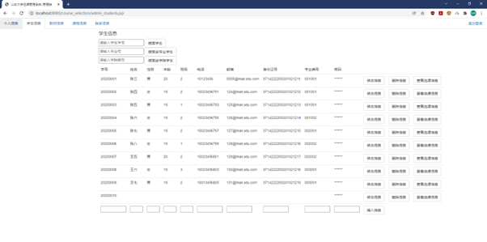

## 1. PL0Compiler

该项目为我实现的一个PL/0语言的编译器，PL/0语言的语法见项目中的PL0_1.txt文件，下面简单介绍了我实现的这个编译器的主要功能

**（1）LexicalAnalyse.cpp** 该文件中我实现了LexicalAnalyse类，用于词法分析。

该类能够将提供的PL/0 语言源程序，从字符流转换为词语流。具体来说，该类完成过滤源程序中的空白符(空格，tab，换行等)，并识别关键字、标识符、数字以及运算符。

**（2）SyntaxAnalyse.cpp** 该文件中我实现了SyntaxAnalyse类，用于语法分析以及目标代码的生成。

利用前面实现的词法分析器，向SyntaxAnalyse提供词语流，该类对词语流进行分析，并生成一颗语法树，或者宣告语法错误，与此同时用语法制导翻译的方式，完成给定语法的语义分析以及目标代码生成。

**（3）Interpreter.cpp** 该文件中我实现了Interpreter类，用于解释目标代码。

利用前面的功能，你已经可以将一个 PL/0 语言程序生成为目标代码了。Interpreter类实现了一个解释器用于解释目标代码，来执行对应指令。

以上是我实现的PL/0编译器的整体功能，更详细的功能实现说明可以见在我写这个编译器时一同写的实验报告，可以在项目文件夹中找到

## **2. opengl**

该文件夹内为计算机图形学实验课上我使用Glut实现的一些基本图形学算法，其中
**E1.cpp** 实现了 DDA 和 Bresenham 画线算法、画圆算法
**E2.cpp** 实现了基于活性边表结构的x扫描线填充算法，这是一种多边形的扫描转换算法
**E3.cpp** 实现了Z-buffering消隐算法
**E4.cpp** 实现了反走样算法
**E5.cpp** 实现了 de-Casteljau 算法来绘制使用不同数量的控制点表示 Bézier 曲线，实现了de-boor 割角算法来绘制使用不同数量的控制点表示 B 样条曲线
**Assignment3** 实现了各种纹理映射模型

此外snake和lifegame文件夹内为我课余时间使用Glut库实现的贪吃蛇游戏、生命游戏

## **3. WordSpellCheck**

该项目为使用BK树结构实现的单词拼写检查器，该项目是数据结构课程的课设
Burkhard-Keller树，是一种基于树的数据结构，被设计于快速查找**近似字符串匹配**，比方说**拼写纠错**，或**模糊查找**，当搜索”aeek”时能返回”seek”和”peek”

在该项目中，我基于Qt平台设计了图形化界面，整体ui如下图，项目内的实验报告中有各部分功能的详细介绍

## **4. CourseManage**

该项目为B/S架构的学生选课管理系统，是大数据课程的课设。

在该项目中使用Html、Css、JavaScript进行前端界面开发，采用MySQL数据库，使用Java Servlet类和JSP进行数据库的访问

下面是该项目中一些界面展示，详细的每个功能的演示可以见项目内的实验报告

